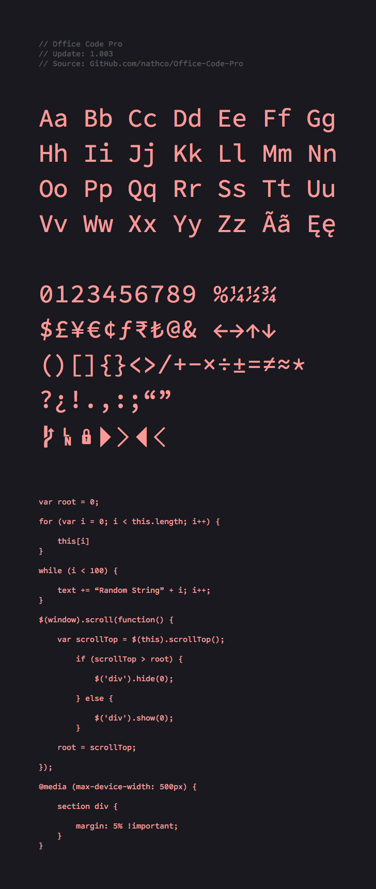

# Office Code Pro 
**Office Code Pro** is a customized version of the **Source Code Pro** type family, originally created for Adobe Systems Incorporated by Paul D. Hunt. The customizations were made specifically for text editors and coding environments, but are still very usable in other applications.

## Preview
    

## Font Variants        

**Office Code Pro**      
Light, Regular, Medium, Bold

**Office Code Pro** ( Dotted Zero )        
Light D, Regular D, Medium D, Bold D    

**Available Formats**  
OpenType, TrueType, EOT, WOFF 

## Languages 

Afrikaans, Albanian, Asu, Basque, Bemba, Bena, Bosnian, Catalan, Chiga, Congo Swahili, Cornish, Croatian, Czech, Danish, Dutch, Embu, English, Esperanto, Estonian, Faroese, Filipino, Finnish, French, Galician, German, Gusii, Hungarian, Icelandic, Indonesian, Irish, Italian, Kabuverdianu, Kalaallisut, Kalenjin, Kamba, Kikuyu, Kinyarwanda, Lithuanian, Luo, Luyia, Machame, Makhuwa-Meetto, Makonde, Malagasy, Malay, Maltese, Manx, Meru, Morisyen, North Ndebele, Norwegian Bokmål, Norwegian Nynorsk, Nyankole, Oromo, Polish, Portuguese, Rombo, Rundi, Rwa, Samburu, Sango, Sangu, Sena, Shambala, Shona, Slovak, Slovenian, Soga, Somali, Spanish, Swahili, Swedish, Swiss German, Taita, Teso, Turkish, Vunjo, Welsh, Zulu  

## OpenType Features  

* Stylistic Alternates
* Denominators & Numerators
* Fractions
* Localized Forms
* Ordinals
* Scientific Inferiors
* Superscript & Subscript    

## Release Notes

**Version 1.002 — Latest**

* Added glyphs for the Powerline statusline plugin
* Increased `tittle` diameter and vertical position
* Minor adjustments to lowercase `a`
* Updated OpenType feature generation

**Version 1.001**

* Added missing `grave` accent mark
* Increased stem width for capital `M`
* Slashes overshoot the baseline now

**Version 1.000**

* Replaced double-story lowercase `g` with single-story glyph
* Increased ascenders, descenders, and x-height by 5%  
* Decreased length of single and double quotation marks
* Increased stem width for `Exclamation Mark`
* Increased the capital `M` width
* Replaced dollar sign to avoid confusion with capital `S`
* Adjusted curly braces for better distinction between `Parenthesis` and `Brackets`
* Increased angle for `Greater` and `Less` glyphs
* Slashes have increased angle and stop at baseline
* Copyright and Published symbols are more circular 
* Added slashed zero glyph  
* Opened the counter on number `four`    
* Removed `fl` and `fi` ligatures  
* Increased stem height for lowercase `t`  
* Decreased the terminal length for lowercase `a`
* Added baseline serifs to lowercase `i`
* Decreased crossbar width for lowercase `i` and `j`
* Adjusted numbers to match the `cap-height`  

## License
This Font Software is licensed under the [SIL Open Font License](http://scripts.sil.org/OFL), Version 1.1  
Copyright © 2015 Nathan Rutzky ( [www.nath.co](http://nath.co) )  
Copyright © 2015 Adobe Systems ( [www.adobe.com](http://adobe.com) )    

## Feedback
If you discover any issues or have questions regarding usage, please send a message to [code@nath.co](mailto:code@nath.co) or find me on GitHub [@nathco](https://github.com/nathco).